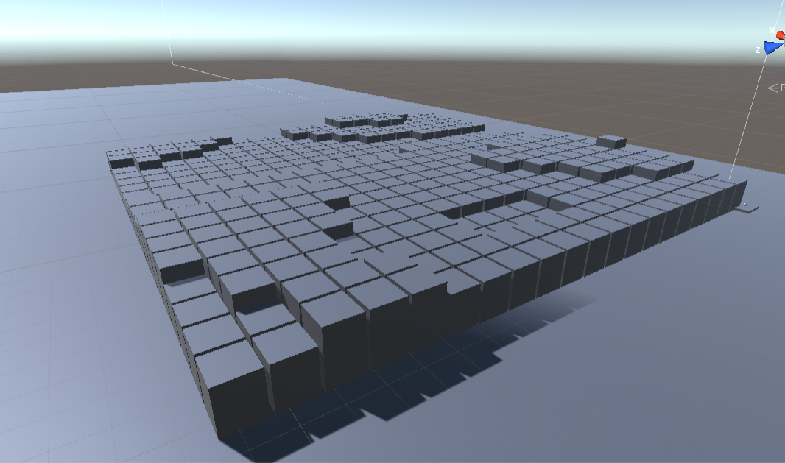
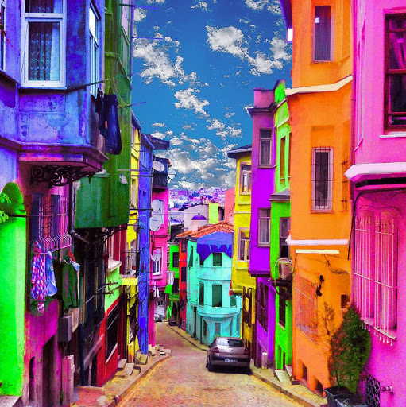
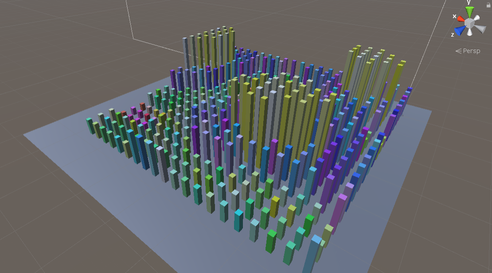
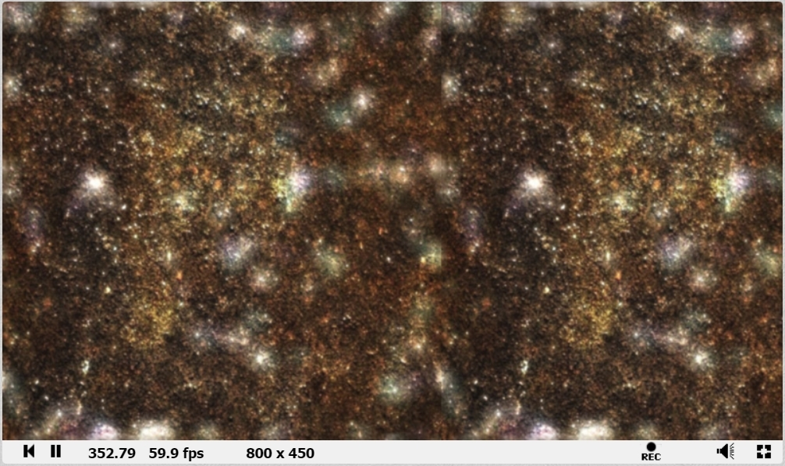

# CMPM163Labs

Tutorial Buildings

Inspiration City (source: http://www.travellushes.com/21-colorful-cities/)

Final City

I started with a personal project I have been working on which involves the player using a grapple hook to maneuver a space. For the game, I really wanted to stick to a more symbolic representation of buildings. Instead of using premade assets, I just used simple cubes. I ended up changing the size of everything to make the scale more appropriate for the player. Eventually I had properly scaled buildings that were amazing to swing from as the player, but it felt quite dead. I looked for interesting looking cities on google, and eventually found a heavily photoshopped image of brightly colored buildings. I started by making all of my buildings just random colors, but found that the randomness was too much, as something made by humans would be random, but still follow certain rules. Ultimately, I made the colors based on the height of the buildings, which lead to really cool effects, and almost brings out a construct of social classes. The taller, "better" buildings are one color and the lower ones are different colors. I can almost see people in this world being like "Oh you work in a green building? It's okay you'll get there eventually."

Here's a video of the game: [link](https://drive.google.com/file/d/1mcEjrZkto7s0gbAUbmjXf8COXvsj0Hmr/view?usp=sharing "I guess this is just a complex cube video")

Partner Responses:
1. They did part one
2. The part that ended up being the most difficult was oddly enough pushing their project onto GitHub. They have a moderate amount of experience with git, but They had never tried to push such a extensive amount of files to the origin repo. They found out that there was a huge PDF file from one of the free assets, advertising their other assets.
3.The most interesting part was seeing how a road system could be implemented randomly, yet structurally.

## Lab 7
Snowy Mountain video: [link](https://drive.google.com/open?id=1r0cW6AVElUbw5bOkvPsjT8XTcRItYdiA "I can't believe its another non cube video")

I made this scene using mostly shaders and one particle system. I started with the boring mountains and water that was made in the tutorial. I started by adding some color to them to make them feel more realistic. I also changed the speed and strength of the waves to create a sense of scale for the mountains. Getting the color of the mountains was quite hard, as I couldn't do it by just trying out things that I already knew. Eventually I ended up looking through every category of nodes until I found the Lerp node. Then it was just a matter of passing variables to control things like height and color into the shader graph. After that, I realized the sky was really boring. I contemplated just finding a sky box online, but figured that to be boring. I ended up messing around in shader graph and eventually used noise to control the shape of the clouds based on their world position, and then added a script to make them move across the space. I then varied their sizes. They are actually all the same base shape, but the shader is modifying their mesh to make them all look unique. Finally I added a fairly simple particle system that would make snow fall all over the mountains. It took a while to get the paramaters right there as well to match the scale set by the water. And there it is! Snowy Mountain scene.

## Lab 6

My Shadertoy: [link](https://www.shadertoy.com/view/3dSBzz "link to another non cube video")

Something cool I found on Shadertoy: [link](https://www.shadertoy.com/view/XsBXWt "wow a third non cube video")

## Lab 5
Video: [link](https://drive.google.com/open?id=1Izm9lSazlhOq39EKCzf2hrjUJiOjP1P4 "link to something that isn't a cube video")

For this project I wanted to see if I could add the classic particle systems found in most racing games. I started by adding a smoke system so that if you were turning hard enough, smoke would come out of the wheels. I had to change the simulation space to "world" so that it would realistically leave the smoke in a 'trail' behind the path of the car. Next I decided to add a celebration firework that would go off whenever you would pass through a check point. This was interesting because I added trails to the particles which really make it look like a firework. The last particle system I added involved adding a new game mechanic. I added a system that would allow you to boost when you hold left shift. Once you held it, it would increase your max speed allowing you to go faster. The particle system I made used the system that allows you to change the color of the particle over its lifetime. I used this to start the particles as blazing white hot and then turning red, then finally turning into smoke. A few smaller touches include modifying the player to have the same skin color as me and the car to be the same color as my car!

## Lab 4
Video: [link](https://drive.google.com/file/d/1gFdLvhPXL-bivbOr8Zn0YwJ-b3Sa8HbJ/view?usp=sharing "link to yet another cubes video")

The tiled cube was made using a formula that mapped the texture( (vUv.x % 0.5) * 2). The second cube from the left was made using three.js with only a texture and no normal map. The middle cube was made using Three.js materials with a texture and a normal map. The forth cube from the left was made by the same method as the middle cube, but with a different texture and normal map. The final cube was made using shaders to parse a texture.

a. u = x/8
b. v = y/8
c. white

## Lab 3

Video: [link](https://drive.google.com/file/d/1-ocZeBH3URbb47b0JOQo5Os_0Ou92bHm/view?usp=sharing "Link to other cubes video")

For the first cube on the left, I created a shader that gradients on the x axis from white to black. It gave it a really cool ghostly look. For the second cube, I created another Three.js material similar to the one created in the tutorial. The third cube is the one from the tutorial made with a Three.js material. The forth cube is the other one from the tutorial made with a fragment shader.

## Lab 2

Video: [link](https://drive.google.com/file/d/1F82mxIKp4eEwQVWIswMUm7CMT9Kl9J8b/view?usp=sharing "Link to cubes video")

