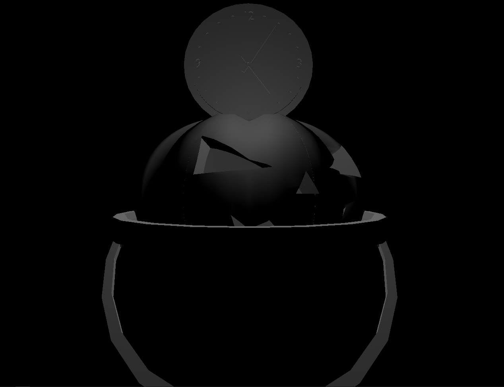

# CMPM163Labs

## Lab 2

Video: [link](https://drive.google.com/file/d/1F82mxIKp4eEwQVWIswMUm7CMT9Kl9J8b/view?usp=sharing "Link to cubes video")

## Lab 3

Video: [link](https://drive.google.com/file/d/1-ocZeBH3URbb47b0JOQo5Os_0Ou92bHm/view?usp=sharing "Link to other cubes video")
For the first cube on the left, I created a shader that gradients on the x axis from white to black. It gave it a really cool ghostly look. For the second cube, I created another Three.js material similar to the one created in the tutorial. The third cube is the one from the tutorial made with a Three.js material. The forth cube is the other one from the tutorial made with a fragment shader.
